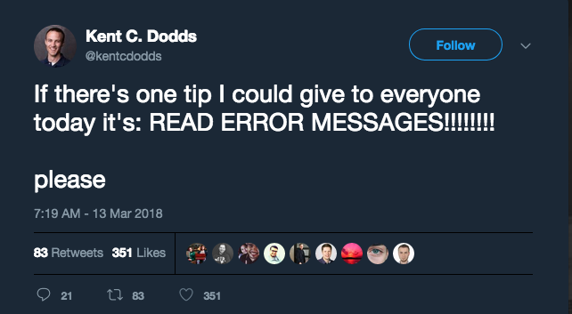

I was thinking recently about how intimidated I was by error messages when I first began to program.
As soon as red text appeared in the browser console or terminal I would begin to feel a little panicked.
My heart rate would rise in proportion to the length of the stack trace.
But somewhere along the way that intimidation just began to vanish.

The change started when I actually stopped to read and attempted to make sense of the errors instead of blindly trying
things until they went away.
I began to think of the computer more as a non native speaker trying to communicate with only a few rehearsed
phrases at its disposal and less like an evil being whose sole enjoyment in life is giving me unsolvable riddles in
cryptic and impenetrable language.

It's trying to tell you that something went wrong, but it can only choose from a few pre-programmed messages.
The good news is computers are logical. They will never tell you something is wrong for no reason.
Although sometimes it seems like they do. The bad news is that means it's always your fault.

It's true. Undefined **really** isn't a function.

The next time you see an error message don't recoil in fear.
Instead, read the error message, follow the stack trace, and try to decipher exactly what it is telling you.
The more you do this the better you'll become at interpreting what the computer is actually trying to tell you.
